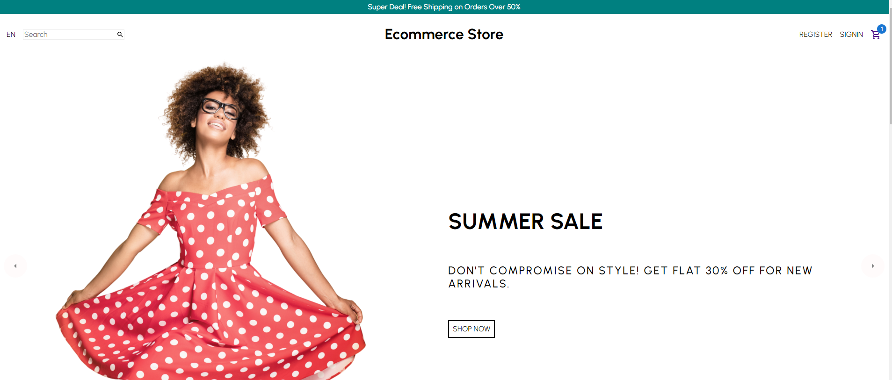
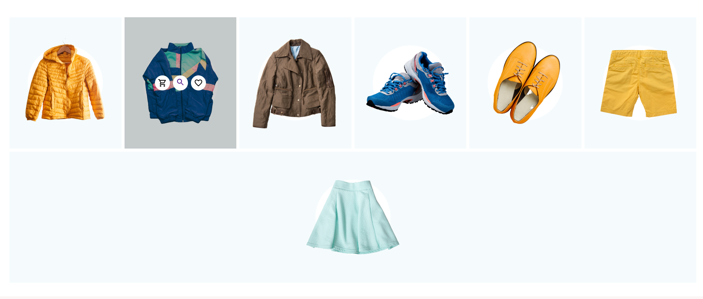
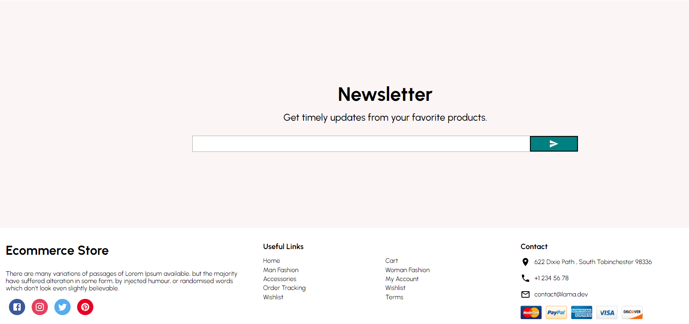
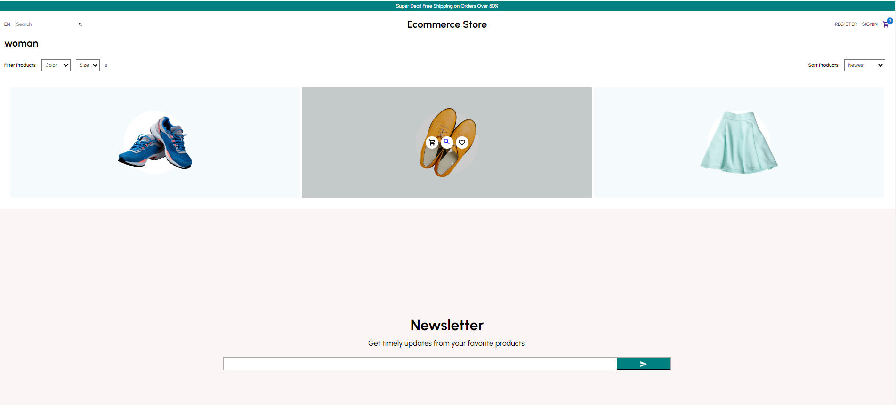
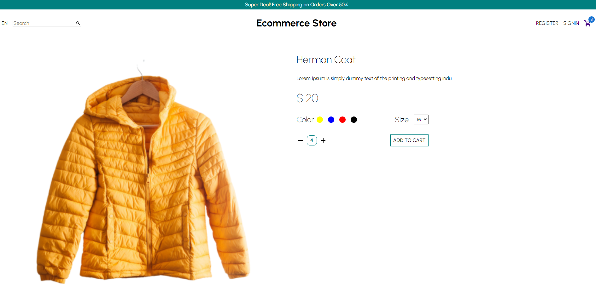
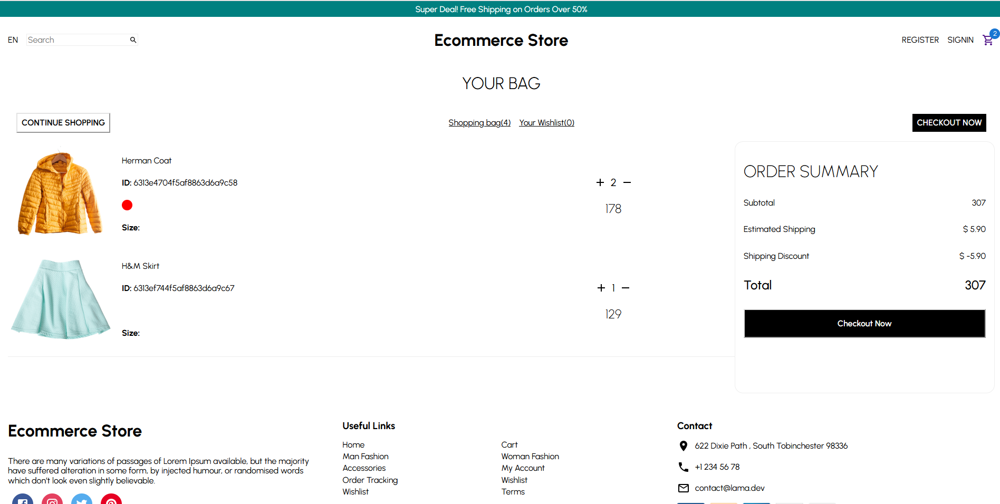
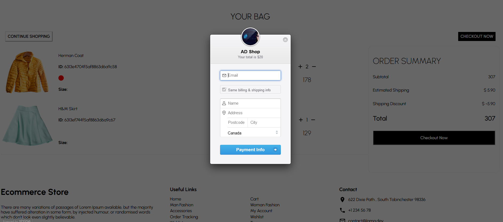
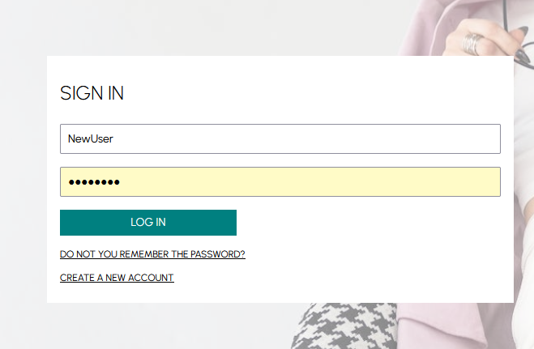
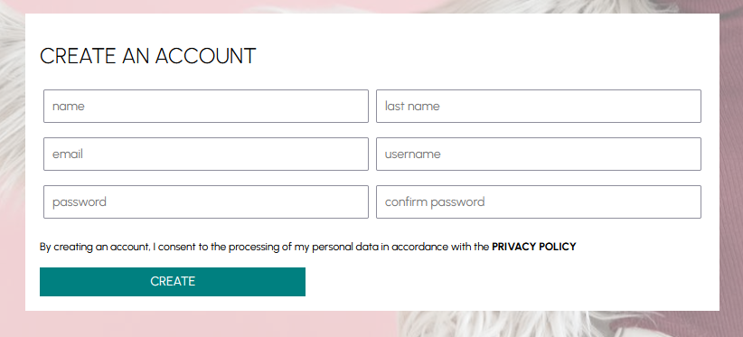

# React Shop

eCommerce web application using React. Homepage has pure React slider, categories, products and other components. Users can find products from home page or categories page. Add products to the cart and checkout.

In this project I used functional reusable React components, React hooks, styled components, Redux toolkit and Stripe for checkout.

You can see the website [here](https://react-shop3.netlify.app/)

This one part of the full solution. 

The backend API is build with Node.js, Express.js and MongoDB You can see it here [here](https://github.com/adarraji/node-shop-api)

Also you can find the React Admin Dashboard [here](https://github.com/adarraji/react-shop-admin)

## Built With

* HTML
* CSS
* Javascript
* React
* Tachyons
* styled-components
* Material-UI
* React Router
* React Hooks
* React Redux / Redux toolkit
* React Stripe Checkout

## Running the Application

To run the application

1. Clone this repo
2. Run `npm install`
3. Run `npm start`

## Environmental Variables

### Server URL

Add server url in  `src/requestMethods.js`

### Stripe secret key

Add Stripe publick key `STRIPE_PUB_KEY` in `src/pages/Cart.js`

## Deployment

Deployed on [Netlify](https://netlify.com)
You can see the website [here](https://react-shop3.netlify.app/)

## Authors

- **Ali Darraji** - [https://github.com/adarraji](https://github.com/adarraji)

## Deploy status

## Screenshots
 

### Home Page

 

 

 

 

 

 
 
 

### Products / Categories Page

 

 

 
 
 

### Single Product Page

 

 

 
 
 

### Cart

 

 

 
 
 

### Payment

 

 

 
 
 

### SiginIn Page

 

 

 
 
 

### Register Page

 

 

 
 
 